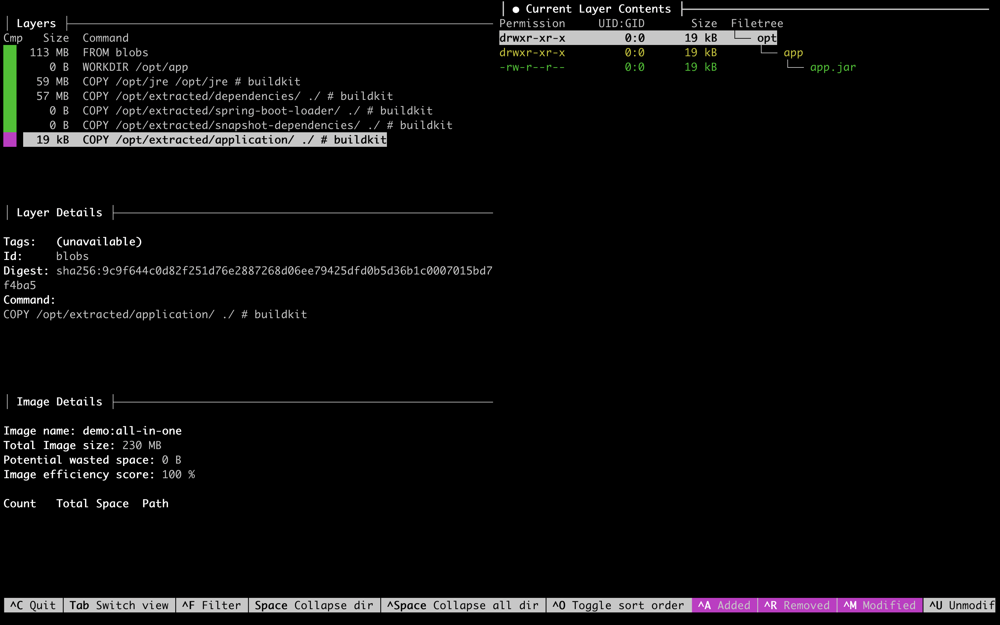

<!-- Generated by Sociable Weaver (https://github.com/albertattard/sw). Manual edits will be overwritten when regenerated. -->

# Spring Boot Web Application with all examples in one place

This all-in-one example packages the same Spring Boot web application using the
container techniques introduced in the earlier runbooks:

- JVM command-line options that size the heap as a percentage of the memory
  available to the container.
- A custom Java runtime built with `jlink`, so the final image does not carry
  the full JDK.
- A CDS archive generated into the custom runtime image, so runtime classes can
  be mapped from preprocessed class metadata at startup.
- Spring Boot layered JAR extraction, so stable dependencies and frequently
  changing application classes can live in separate container layers.
- A Project Leyden AOT cache created during the image build and reused when the
  container starts.
- Multi-platform image output, so the same image reference can provide
  platform-specific `linux/amd64` and `linux/arm64` variants.
- Diagnostic support for `jcmd`, Java Flight Recorder (JFR), and Native Memory
  Tracking (NMT), so the custom runtime remains supportable after the full JDK
  is removed from the final image.
- Container image hygiene checks that make the runtime user, startup command,
  base-image inputs, packaged components, and vulnerability scan output
  reviewable.

The purpose of this runbook is to show how those techniques fit together in one
Dockerfile. Treat this as the recommended baseline from this workshop for a
Spring Boot service when you want a smaller runtime image, repeatable startup
behaviour, useful Docker layer reuse, and a container that does not run as root.
It is still a baseline, not a rule to apply blindly: teams should validate the
selected Java modules, observability needs, startup improvements, and base-image
policy against their own service before promoting the image pattern to
production.

That validation includes the diagnostics choices. This runbook enables
`-XX:NativeMemoryTracking=summary` because the image is meant to support NMT
inspection with `jcmd`, and NMT must be enabled at JVM startup. In production,
keep that flag only when native memory diagnostics are an expected operational
requirement. It has runtime overhead, so treat it as a deliberate observability
tradeoff, not a default hardening or performance recommendation.

The sections below are self-contained and explain the combined flow. The
individual runbooks remain useful when you want the slower, more detailed
explanation of each technique.

- [Spring Boot Web Application using Container Friendly Command Line Options](../java-command-line-options-spring-boot/README.md)
- [Spring Boot Web Application using Slim Java runtime (JRE)](../jlink-slim-image-spring-boot/README.md)
- [Spring Boot Web Application using Class Data Sharing (CDS)](../jlink-cds-image-spring-boot/README.md)
- [Spring Boot Web Application using Project Leyden AOT Cache](../leyden-aot-cache-spring-boot/README.md)
- [Spring Boot Web Application using Layered JAR](../layered-jar-spring-boot/README.md)
- [Spring Boot Web Application using Multi-Architecture Image Builds](../jlink-multi-architecture-spring-boot/README.md)
- [Spring Boot Container Diagnostics](../container-diagnostics-spring-boot/README.md)
- [Spring Boot Web Application using Container Image Hygiene Checks](../container-image-hygiene-spring-boot/README.md)

## Prerequisites

- [Oracle Java 25](https://www.oracle.com/java/technologies/downloads/#java25)

- Either [Docker](https://docs.docker.com/get-docker/) with Buildx, or
  [Podman](https://podman.io/) with manifest support.

- `curl`, used to call the Spring Boot endpoint.

- `jq`, used to format the JSON response returned by the application.

- `tree`, used to inspect generated directories in the walkthrough.

- [Syft](https://github.com/anchore/syft), used to generate an SBOM for
  the final container image.

- [Trivy](https://github.com/aquasecurity/trivy), used to scan the final
  container image.

- [Crane](https://github.com/google/go-containerregistry/tree/main/cmd/crane),
  used to resolve base-image digests without requiring Docker Buildx.

- [Dive](https://github.com/wagoodman/dive), or a similar tool, is optional
  and used only when visually inspecting image layers.

- [Oracle Account](https://profile.oracle.com/myprofile/account/create-account.jspx)
  to access [Oracle Container Registry](https://container-registry.oracle.com/)

- An Oracle Container Registry authentication token stored in
  `~/.ocr/auth-token`, or an equivalent secure way to pass the password to
  `docker login --password-stdin`.

- A container build backend that can execute both `linux/amd64` and
  `linux/arm64` containers. This is required because the Dockerfile runs
  `dnf` and `jlink` while building each platform variant.

  The backend that you choose must be configured to support both platforms.
  For example, a Docker Buildx builder may provide this support directly,
  while a Podman host may need `binfmt` handlers for foreign architectures,
  such as:

  ```shell
  podman run --privileged --rm docker.io/tonistiigi/binfmt --install all
  ```

  Configure the backend that you will use before continuing, regardless of the
  operating system on which it runs.

### Accept the Terms and Conditions

Before you can use the Oracle Java images, you need to accept the terms and
conditions by navigating to
[https://container-registry.oracle.com/ords/ocr/ba/java/jdk](https://container-registry.oracle.com/ords/ocr/ba/java/jdk)
and logging in.

1. Accept the
   [Oracle Container Registry](https://container-registry.oracle.com/) terms and
   conditions.

   

   

2. Log in to `container-registry.oracle.com` using your Oracle account.

   The container tool needs access to Oracle Container Registry before it can
   pull the Oracle Java base image referenced by the Dockerfile. This example
   reads an Oracle authentication token from `~/.ocr/auth-token` and passes it
   to the login command through standard input so the token is not written into
   the shell history. If you are using Podman instead of Docker, use the same
   registry, username, and token with `podman login --password-stdin`.

   ```shell
   docker login container-registry.oracle.com \
     --username 'ALBERT.ATTARD@ORACLE.COM' \
     --password-stdin < ~/.ocr/auth-token
   ```

   This should print the login succeeded message.

   ```
   Login Succeeded!
   ```

   The container image used
   ([`container-registry.oracle.com/java/jdk:25.0.4.1`](https://container-registry.oracle.com/ords/ocr/ba/java/jdk))
   requires authentication.

## Build the application

The application is built once and then reused for the local runtime checks and
container image build. This matters because the container packaging should be
the only moving part; changing the application build at the same time would make
the result harder to reason about.

1. Build the application

   ```shell
   ./mvnw clean package
   ```

   (*Optional*) Verify that the application was created.

   ```shell
   tree --dirsfirst --sort=name -L 1 --prune './target/'
   ```

   Spring Boot creates one executable JAR containing the application classes,
   Spring Boot launcher, and nested dependency JARs.

   ```
   ./target/
   ├── all-in-one-spring-boot-1.0.0.jar
   └── all-in-one-spring-boot-1.0.0.jar.original

   1 directory, 2 files
   ```

2. (*Optional*) Run the application

   This starts the packaged JAR exactly as a developer would run it outside a
   container. The check is intentionally simple: before changing the runtime
   layout, first prove that the application artefact itself works.

   ```shell
   java -jar './target/all-in-one-spring-boot-1.0.0.jar' > './target/output.txt' 2>&1 &
   echo $! > './target/application.pid'
   ```

   Wait for the application to start.

   ```shell
   while [ "$(curl --silent --output /dev/null --write-out '%{http_code}' 'http://localhost:8080/quote/random')" -ne '200' ]
   do
     echo 'Waiting for the application to start'
     sleep 1
   done
   ```

   Fetch a random quote.

   ```shell
   curl --silent 'http://localhost:8080/quote/random' | jq
   ```

   The response should be similar to the following.

   ```json
   {
     "author": "Aristotle",
     "id": 23,
     "quote": "Patience is bitter, but its fruit is sweet."
   }
   ```

   Stop the application.

   ```shell
   kill "$(cat './target/application.pid')"
   ```

## All in One Example

This Dockerfile combines the earlier container ideas into one production-style
image build. It uses a multi-stage build so the tools needed to construct the
runtime stay in the builder stage and do not become part of the final image. The
builder stage uses the authenticated Oracle JDK image because it needs
development tools such as `jlink` and a full Java launcher for extracting the
Spring Boot layers. The final stage uses a smaller Oracle Linux base image and
copies only the custom runtime plus the extracted application.

The result is a smaller runtime image than a full-JDK image while still keeping
the Spring Boot layer layout that helps rebuilds reuse unchanged dependency
layers.

Read the Dockerfile as a sequence of engineering decisions:

- Pins both base images with tag plus digest, so the Java builder image and the
  final Oracle Linux image are readable and reproducible inputs.
- Creates a custom Java runtime with `jlink`, containing the Java modules
  needed by this application plus the selected diagnostics modules `jdk.jcmd`
  and `jdk.jfr`.
- Generates a runtime CDS archive into that custom runtime with
  `jlink --generate-cds-archive`, so core runtime class metadata is prepared
  during the image build.
- Extracts the Spring Boot executable JAR into Spring Boot layers, which keeps
  dependency files separate from application files and improves rebuild cache
  reuse.
- Writes a stable explicit class path to `java.args`, avoiding runtime wildcard
  expansion when the application starts.
- Creates a Project Leyden AOT cache with the custom runtime, using the same
  class path that the final container will use.
- Supports multi-platform builds because `jlink` and the Leyden training run
  execute inside each requested target platform variant.
- Copies the custom runtime, dependency layer, application layer, argument file,
  and AOT cache into the final image.
- Runs the container as a non-root numeric user, avoiding a root process inside
  the container while staying independent of named users in the image.
- Sets `JDK_JAVA_OPTIONS` so the JVM sizes the heap from the container memory
  limit, enables Native Memory Tracking, and fails fast if the AOT cache cannot
  be used.

`JDK_JAVA_OPTIONS` is used here because it is picked up automatically by the
Java launcher. That keeps the memory policy in the image configuration while
still allowing `docker run` callers to add or override normal command-line
arguments when needed.

The custom runtime intentionally includes selected diagnostic modules. A minimal
`jlink` runtime can serve HTTP traffic while still removing the tools needed
during an incident. This image keeps `jcmd` and JFR available, and starts the
JVM with `-XX:NativeMemoryTracking=summary` because NMT must be enabled at
startup. That is an operational choice, not a universal module list: teams
should decide which diagnostics their support model requires before trimming the
runtime.

The AOT cache is sensitive to the JDK build, runtime image, operating system,
architecture, and class path used to create it. This Dockerfile creates the
cache inside the builder stage with the same custom runtime copied into the
final image. It also reuses `java.args` at startup so the dependency JAR order
matches the training run. Do not replace the argument file with a wildcard such
as `extracted/BOOT-INF/lib/*`; a different expansion order can make the JVM
reject the cache.

This point matters more for multi-platform builds. The `linux/amd64` image
variant must contain an `amd64` custom runtime and an AOT cache created with
that runtime; the `linux/arm64` image variant must contain the corresponding
`arm64` runtime and cache. Building those artefacts once on the host and
copying them into every variant would be incorrect.

This all-in-one image uses CDS at the runtime-image level and Leyden at the
application-startup level. The separate CDS runbook also demonstrates
Application CDS with `-XX:SharedArchiveFile`, but stacking Application CDS and
the Leyden AOT cache in this combined Dockerfile would make the example harder
to reason about: both workflows target application startup state. Runtime CDS,
by contrast, belongs to the `jlink` runtime and composes cleanly with the
application AOT cache created later in the build.

Image hygiene is included here because these checks must be applied to the final
all-in-one image itself: reviewers should inspect its runtime user, startup
command, pinned base images, component inventory, vulnerability scan results,
and diagnostic readiness.

```dockerfile
FROM container-registry.oracle.com/java/jdk:25.0.4.1@sha256:8d233560cfa91301d256148ecb6f031b3c96a77bf4153dad8bae65b4ecb19bb9 AS builder
WORKDIR /opt/app

ARG JAVA_MODULES=java.base,java.compiler,java.desktop,java.instrument,java.management,java.naming,java.sql,java.security.jgss,jdk.jcmd,jdk.jfr

# binutils are needed by the `--strip-debug` command line option
RUN dnf install -y binutils && dnf clean all
RUN jlink \
      --output './jre' \
      --generate-cds-archive \
      --no-header-files \
      --no-man-pages \
      --strip-debug \
      --add-modules "${JAVA_MODULES}" \
      --compress=zip-9

ARG JAR_FILE=./target/all-in-one-spring-boot-1.0.0.jar

COPY ${JAR_FILE} app.jar

# The AOT cache is tied to the exact runtime and class path used during
# training. Create the cache with the custom runtime produced above, then reuse
# the same java.args file at container startup.
RUN java -Djarmode=tools -jar 'app.jar' extract --layers --destination 'extracted' \
    && printf '%s\n' '--class-path' "extracted/application/app.jar:$(find 'extracted' -path '*/lib/*.jar' -type f | sort | paste -sd ':' -)" 'demo.Main' > 'java.args' \
    && /opt/app/jre/bin/java \
        -Dspring.context.exit=onRefresh \
        -XX:AOTCacheOutput='app.aot' \
        @java.args

FROM container-registry.oracle.com/os/oraclelinux:10-slim@sha256:0e951757cac91a9f5f384a46e3f88306df8a8314cde1eaf94e69a406a8c8b646
WORKDIR /opt/app

# Copy the custom Java image
COPY --from=builder /opt/app/jre /opt/jre

# Use an arbitrary high numeric UID so the container does not run as root.
COPY --chown=10001:0 --from=builder /opt/app/extracted/dependencies/          ./extracted/dependencies/
COPY --chown=10001:0 --from=builder /opt/app/extracted/snapshot-dependencies/ ./extracted/snapshot-dependencies/
COPY --chown=10001:0 --from=builder /opt/app/extracted/application/           ./extracted/application/
COPY --chown=10001:0 --from=builder /opt/app/java.args                        ./java.args
COPY --chown=10001:0 --from=builder /opt/app/app.aot                          ./app.aot
USER 10001:0

# Add the custom runtime tools to PATH so `docker exec ... jcmd` works.
ENV PATH="/opt/jre/bin:${PATH}"

EXPOSE 8080

ENV JDK_JAVA_OPTIONS="-XX:MinRAMPercentage=75.0 -XX:MaxRAMPercentage=75.0 -XX:NativeMemoryTracking=summary -XX:AOTCache=app.aot -XX:AOTMode=on"

# Reuse java.args so runtime sees the same class path order used to create the
# AOT cache.
ENTRYPOINT ["/opt/jre/bin/java", "@java.args"]
```

1. Build the container image.

   The build context must include the JAR created earlier in `target/`. Docker
   first builds the custom runtime, extracts the JAR into Spring Boot layers,
   creates the Leyden AOT cache, and then assembles the final image from the
   smaller Oracle Linux base. The `--load` option makes the image available to
   the local Docker engine after the build, which is useful for this workshop
   because the next steps inspect and run it locally.

   ```shell
   docker build \
     --file './containers/Dockerfile' \
     --tag 'demo:all-in-one' \
     --load \
     .
   ```

   The first build may take longer because Docker needs to pull the base images
   and install `binutils` in the builder stage. Later builds should reuse more
   layers when the base image, Maven artefact, and Dockerfile steps are
   unchanged.

2. (*Optional*) Analyse the container image

   List the layers that were added by the Dockerfile. The output should show the
   custom runtime copy, dependency and application layer copies, the AOT cache,
   and the JVM options configured through the image environment.

   ```shell
   docker history 'demo:all-in-one'
   ```

   The history of the `all-in-one` image.

   ```
   ID            CREATED                 CREATED BY                                     SIZE        COMMENT
   09136a3a152d  Less than a second ago  /bin/sh -c #(nop) ENTRYPOINT ["/opt/jre/bi...  0B
   <missing>     Less than a second ago  /bin/sh -c #(nop) ENV JDK_JAVA_OPTIONS="-X...  0B
   <missing>     Less than a second ago  /bin/sh -c #(nop) EXPOSE 8080                  0B
   <missing>     Less than a second ago  /bin/sh -c #(nop) ENV PATH="/opt/jre/bin:$...  0B
   <missing>     Less than a second ago  /bin/sh -c #(nop) USER 10001:0                 0B
   <missing>     1 second ago            /bin/sh -c #(nop) COPY file:2a9eec66680ef5...  109MB
   459f4409ed8b  1 second ago            /bin/sh -c #(nop) COPY file:4cfd58485b6d4a...  6.66kB
   a77f970499c7  1 second ago            /bin/sh -c #(nop) COPY dir:2fd444bd8fb13c3...  22kB
   820b7c866864  6 minutes ago           /bin/sh -c #(nop) COPY dir:5f70bf18a086007...  3.07kB
   e6d2bf19e158  6 minutes ago           /bin/sh -c #(nop) COPY dir:14a56f02f2b29f4...  56.3MB
   a04d6e9b64ed  6 minutes ago           /bin/sh -c #(nop) COPY dir:1d733f3b93bcd18...  91.6MB
   0bcea1b4ecb6  6 minutes ago           /bin/sh -c #(nop) WORKDIR /opt/app             0B          FROM container-registry.oracle.com/os/oraclelinux@sha256:0e951757cac91a9f5f384a46e3f88306df8a8314cde1eaf94e69a406a8c8b646
   <missing>     4 months ago            /bin/sh -c #(nop) CMD ["/bin/bash"]            0B          FROM ffa927039da1
   <missing>     4 months ago            /bin/sh -c #(nop) ADD file:28d99faef5a2498...  97.4MB
   ```

   Analyse the container image using Dive.

   ```shell
   dive 'demo:all-in-one'
   ```

   

3. Build a multi-platform OCI archive

   The local image built above is useful for the smoke tests and diagnostics
   that follow because it can be loaded into the local Docker engine. A
   multi-platform build has a different output shape: it produces an OCI image
   index that points to separate platform-specific image manifests. In this
   example, each image manifest contains a custom runtime and Leyden AOT cache
   created for that target platform.

   Docker Buildx and Podman can both produce a multi-platform OCI archive
   without pushing to a registry. The important difference from the plain
   multi-architecture example is that this Dockerfile runs `jlink` during the
   build. The builder must therefore execute the `RUN jlink` step in a way that
   produces a valid runtime for each requested target platform.

   The Docker and Podman commands are both shown for completeness. Execute the
   option that matches the environment used for the workshop. Both commands will
   produce the OCI image archive and save it to
   `./target/all-in-one-multi-arch.tar`.

   The `--platform` option tells the builder which operating system and CPU
   architecture combinations to build for. Here we request two Linux image
   variants: `linux/amd64` for x86-64 machines and `linux/arm64` for 64-bit ARM
   machines.

   - Using Docker.

     ```shell
     docker buildx build \
       --platform 'linux/amd64,linux/arm64' \
       --file './containers/Dockerfile' \
       --tag 'demo:all-in-one-multi-arch' \
       --output 'type=oci,dest=./target/all-in-one-multi-arch.tar' \
       .
     ```

     The `--output 'type=oci,dest=./target/all-in-one-multi-arch.tar'` option
     exports the build result as an OCI image archive instead of loading it
     directly into the local image store. Because this build targets multiple
     platforms, the archive contains an OCI image index together with the
     platform-specific image manifests and layers.

   - Using Podman.

     ```shell
     podman manifest rm 'demo:all-in-one-multi-arch' 2>/dev/null || true

     podman build \
       --platform 'linux/amd64,linux/arm64' \
       --security-opt 'label=disable' \
       --file './containers/Dockerfile' \
       --manifest 'demo:all-in-one-multi-arch' \
       .

     podman manifest push \
       'demo:all-in-one-multi-arch' \
       'oci-archive:./target/all-in-one-multi-arch.tar'
     ```

     `--manifest` names the Podman manifest list that collects the `linux/amd64`
     and `linux/arm64` images produced by this build. The subsequent
     `podman manifest push` command exports that manifest list, together with
     its platform-specific images, to the OCI archive.

     `--security-opt 'label=disable'` disables SELinux labelling for the
     temporary build containers. This allows the QEMU interpreter registered
     through `binfmt` to execute the foreign-architecture build steps on hosts
     where the default Podman SELinux label prevents it. It does not change the
     SELinux labelling of containers created from the resulting image.

   The first build may take longer because Docker needs to pull the base images
   and install `binutils` in the builder stage. Later builds should reuse more
   layers when the base image, Maven artefact, and Dockerfile steps are
   unchanged.

   (*Optional*) Verify that the file was created.

   ```shell
   tree --dirsfirst --sort=name --prune -P '*.tar' './target'
   ```

   The OCI image archive should now be present under `target`.

   ```
   ./target
   ├── all-in-one-multi-arch.tar
   └── all-in-one.tar

   1 directory, 2 files
   ```

   Inspect the OCI image index stored in the archive.

   ```shell
   IMAGE_INDEX_DIGEST="$(
     tar --extract --to-stdout --file './target/all-in-one-multi-arch.tar' 'index.json' \
       | jq --raw-output '.manifests[0].digest | sub("^sha256:"; "")'
   )"

   tar --extract --to-stdout --file './target/all-in-one-multi-arch.tar' "blobs/sha256/${IMAGE_INDEX_DIGEST}" | jq
   ```

   The archive contains one image manifest per requested platform.

   ```json
   {
     "schemaVersion": 2,
     "mediaType": "application/vnd.oci.image.index.v1+json",
     "manifests": [
       {
         "mediaType": "application/vnd.oci.image.manifest.v1+json",
         "digest": "sha256:6edaf0a5bcb2e0157f203df04b9291624b8f72bc6d1ee72ff57e21f762355648",
         "size": 1701,
         "platform": {
           "architecture": "amd64",
           "os": "linux"
         }
       },
       {
         "mediaType": "application/vnd.oci.image.manifest.v1+json",
         "digest": "sha256:9d0645de15445c9e99b7b97204226ab465829350349d90df1d5ebc30cb92f557",
         "size": 1701,
         "platform": {
           "architecture": "arm64",
           "os": "linux"
         }
       },
       {
         "mediaType": "application/vnd.oci.image.manifest.v1+json",
         "digest": "sha256:8712f3876f7bb8292647cda8b5032096cfadbb00de8050196cd1488fd715d1b7",
         "size": 1701,
         "platform": {
           "architecture": "amd64",
           "os": "linux"
         }
       },
       {
         "mediaType": "application/vnd.oci.image.manifest.v1+json",
         "digest": "sha256:d1daececc1be8f285dab76ae9eabbbb92fc2bad64dc3e6a824d14eab603f48dd",
         "size": 1701,
         "platform": {
           "architecture": "arm64",
           "os": "linux"
         }
       }
     ]
   }
   ```

   The archive’s image index contains one descriptor for each requested
   platform. Different manifest digests are expected because the custom runtime,
   AOT cache, and base-image layers are platform-specific. The application
   bytecode is shared input, but the Java runtime and startup cache are not
   architecture-neutral.

4. Review container image hygiene

   The dedicated image-hygiene runbook introduces these checks with smaller
   Dockerfiles so each decision is easier to isolate. The all-in-one image
   should still produce the same kind of evidence after the packaging techniques
   are combined. A working image is not enough; reviewers should be able to see
   which user starts the process, which command runs by default, which
   base-image bytes were used, what components are present, and which known
   vulnerabilities apply at scan time.

   Start with the image configuration. The Dockerfile should declare the numeric
   non-root user, the fixed Java entrypoint, and the JVM options that enable the
   container memory policy and the AOT cache.

   ```shell
   docker image inspect 'demo:all-in-one' \
     --format 'user={{.Config.User}} entrypoint={{json .Config.Entrypoint}} env={{json .Config.Env}}'
   ```

   The output should show `user=10001:0`, the `/opt/jre/bin/java` entrypoint,
   and `JDK_JAVA_OPTIONS` with the memory, NMT, and AOT cache options.

   ```
   user=10001:0 entrypoint=["/opt/jre/bin/java","@java.args"] env=["PATH=/opt/jre/bin:/usr/local/sbin:/usr/local/bin:/usr/sbin:/usr/bin:/sbin:/bin","JDK_JAVA_OPTIONS=-XX:MinRAMPercentage=75.0 -XX:MaxRAMPercentage=75.0 -XX:NativeMemoryTracking=summary -XX:AOTCache=app.aot -XX:AOTMode=on"]
   ```

   Confirm the effective runtime identity as well. Image metadata explains what
   the Dockerfile requested; starting a container with `id` shows what the
   runtime actually applies.

   ```shell
   docker run --rm --entrypoint id 'demo:all-in-one'
   ```

   The container should run as the numeric user configured by the Dockerfile.

   ```
   uid=10001(10001) gid=0(root) groups=0(root)
   ```

   Verify the digests for the base images used by the multi-stage build. The
   Dockerfile pins each base image with tag plus digest: the tag keeps the Java
   and Oracle Linux versions readable, while the digest identifies the exact
   manifest used by the build. Updating either base image should be an
   intentional reviewable change.

   ```shell
   crane digest 'container-registry.oracle.com/java/jdk:25.0.4.1'
   crane digest 'container-registry.oracle.com/os/oraclelinux:10-slim'
   ```

   Record these digests when promoting the pattern into a reproducible build
   pipeline, and compare them with the pinned `FROM` lines in the Dockerfile.
   Tags alone do not identify exact image bytes.

   ```
   sha256:947650420cbf1a8d0ade992ed0cdc2edab4f8d4da1b80f501a56d3392e09e921
   sha256:62bf27d0b94c85634fca838af6916e66e2cd9eb34f87da79dfae199219639776
   ```

   Generate an SBOM from the image that was just built. Saving the image to an
   archive keeps the scanner input tied to this local artefact instead of
   relying on each tool to resolve the tag independently.

   ```shell
   docker save \
     --output 'target/all-in-one.tar' \
     'demo:all-in-one'
   syft 'docker-archive:target/all-in-one.tar' \
     --output 'cyclonedx-json=target/all-in-one-sbom.cdx.json'
   ```

   Print the image archive described by the SBOM and the number of components
   discovered in it.

   ```shell
   jq '.metadata.component.name, (.components | length)' 'target/all-in-one-sbom.cdx.json'
   ```

   The image archive described by the SBOM and the number of discovered
   components.

   ```
   "target/all-in-one.tar"
   1587
   ```

   Review the generated CycloneDX JSON file when you need the full inventory.

   Scan the same saved image archive. Treat the result as review evidence, not
   as a proof that the image is secure. Scanner output depends on vulnerability
   databases, package metadata, severity mappings, and the date of the scan.

   ```shell
   trivy image \
     --severity HIGH,CRITICAL \
     --ignore-unfixed \
     --scanners vuln \
     --format json \
     --input 'target/all-in-one.tar' \
     | jq '{results: [.Results[] | {target: .Target, type: .Type, vulnerabilities: ((.Vulnerabilities // []) | length)}]}'
   ```

   Review scanner findings in context. A clean scan is not a substitute for
   provenance, patching, image pinning, and runtime hardening.

   ```json
   {
     "results": [
       {
         "target": "target/all-in-one.tar (oracle 10.1)",
         "type": "oracle",
         "vulnerabilities": 0
       },
       {
         "target": "Java",
         "type": "jar",
         "vulnerabilities": 3
       }
     ]
   }
   ```

   This scan reported zero known fixable HIGH or CRITICAL vulnerabilities in the
   detected OS and three in the Java components of this image archive at the
   time the scan was run.

5. (*Optional*) Run the all-in-one container image

   This final check verifies that the image still behaves like the locally run
   Spring Boot application after the runtime has been slimmed, the JAR has been
   extracted into layers, the startup command has been converted to an explicit
   class path, and the AOT cache has been enabled. It is a functional smoke
   test, not a performance benchmark.

   ```shell
   docker run \
     --rm \
     --detach \
     --name 'all-in-one' \
     --publish 8080:8080 \
     'demo:all-in-one'
   ```

   Wait for the container to start.

   ```shell
   while [ "$(curl --silent --output /dev/null --write-out '%{http_code}' 'http://localhost:8080/quote/random')" -ne '200' ]
   do
     if [ "$(docker inspect --format '{{.State.Running}}' 'all-in-one' 2>/dev/null)" != 'true' ]; then
       echo 'The container exited before the application became ready'
       docker logs 'all-in-one'
       exit 1
     fi
     echo 'Waiting for the container to start'
     sleep 1
   done
   ```

   Fetch a random quote.

   ```shell
   curl --silent 'http://localhost:8080/quote/random' | jq
   ```

   The response should be similar to the following.

   ```json
   {
     "author": "Alexander Pope",
     "id": 16,
     "quote": "To err is human; to forgive, divine."
   }
   ```

6. Verify runtime diagnostics.

   The image should still be diagnosable after replacing the full JDK with the
   custom runtime. This check uses `jcmd` from inside the running container,
   confirms Native Memory Tracking is available, and exercises the basic JFR
   lifecycle.

   ```shell
   docker exec \
     'all-in-one' \
     jcmd
   ```

   The custom runtime includes `jcmd`, so it can list the application JVM and
   the short-lived `jcmd` process used to inspect it. In this container, process
   `1` is the Spring Boot application.

   ```
   1 demo.Main
   52 jdk.jcmd/sun.tools.jcmd.JCmd
   ```

   Inspect Native Memory Tracking.

   ```shell
   docker exec \
     'all-in-one' \
     jcmd 1 VM.native_memory summary
   ```

   NMT reports native memory reservations and committed memory by JVM subsystem.
   This works because the runtime includes `jcmd` and the JVM was started with
   `-XX:NativeMemoryTracking=summary`.

   ```
   1:

   Native Memory Tracking:

   (Omitting categories weighting less than 1KB)

   Total: reserved=26424101KB, committed=786181KB
          malloc: 95213KB #102880, peak=135250KB #101663
          mmap:   reserved=26328888KB, committed=690968KB

   -                 Java Heap (reserved=24297472KB, committed=524288KB)
                               (mmap: reserved=24297472KB, committed=524288KB, at peak)

   -                     Class (reserved=1049348KB, committed=1924KB)
                               (classes #17242)
                               (  instance classes #15875, array classes #1367)
                               (malloc=772KB tag=Class #22648) (at peak)
                               (mmap: reserved=1048576KB, committed=1152KB, at peak)
                               (  Metadata:   )
                               (    reserved=65536KB, committed=9536KB)
                               (    used=9356KB)
                               (    waste=180KB =1.89%)
                               (  Class space:)
                               (    reserved=1048576KB, committed=1152KB)
                               (    used=962KB)
                               (    waste=190KB =16.50%)

   -                    Thread (reserved=46231KB, committed=3095KB)
                               (threads #45)
                               (stack: reserved=46080KB, committed=2944KB, peak=2944KB)
                               (malloc=103KB tag=Thread #268) (peak=111KB #272)
                               (arena=48KB #82) (peak=896KB #56)

   -                      Code (reserved=253498KB, committed=15554KB)
                               (malloc=4717KB tag=Code #22229) (peak=4717KB #22230)
                               (mmap: reserved=248780KB, committed=10836KB, at peak)
                               (arena=1KB #1) (peak=34KB #2)

   -                        GC (reserved=525764KB, committed=61444KB)
                               (malloc=18052KB tag=GC #4002) (peak=18062KB #3641)
                               (mmap: reserved=507712KB, committed=43392KB, at peak)
                               (arena=0KB #0) (peak=8KB #8)

   -                  Compiler (reserved=379KB, committed=379KB)
                               (malloc=180KB tag=Compiler #943) (peak=180KB #943)
                               (arena=198KB #10) (peak=98448KB #34)

   -                  Internal (reserved=1388KB, committed=1388KB)
                               (malloc=1352KB tag=Internal #6818) (at peak)
                               (mmap: reserved=36KB, committed=36KB, at peak)

   -                     Other (reserved=36KB, committed=36KB)
                               (malloc=36KB tag=Other #4) (at peak)

   -                    Symbol (reserved=2660KB, committed=2660KB)
                               (malloc=2300KB tag=Symbol #34969) (at peak)
                               (arena=360KB #1) (at peak)

   -    Native Memory Tracking (reserved=1828KB, committed=1828KB)
                               (malloc=19KB tag=Native Memory Tracking #314) (at peak)
                               (tracking overhead=1808KB)

   -        Shared class space (reserved=114688KB, committed=98776KB, readonly=0KB)
                               (mmap: reserved=114688KB, committed=98776KB, peak=100176KB)

   -               Arena Chunk (reserved=64466KB, committed=64466KB)
                               (malloc=64466KB tag=Arena Chunk #2133) (peak=108506KB #2295)

   -                   Tracing (reserved=12KB, committed=12KB)
                               (malloc=12KB tag=Tracing #54) (at peak)

   -                    Module (reserved=107KB, committed=107KB)
                               (malloc=107KB tag=Module #2620) (at peak)

   -                 Safepoint (reserved=8KB, committed=8KB)
                               (mmap: reserved=8KB, committed=8KB, at peak)

   -           Synchronization (reserved=590KB, committed=590KB)
                               (malloc=590KB tag=Synchronization #5797) (at peak)

   -            Serviceability (reserved=17KB, committed=17KB)
                               (malloc=17KB tag=Serviceability #14) (peak=20KB #18)

   -                 Metaspace (reserved=65608KB, committed=9608KB)
                               (malloc=72KB tag=Metaspace #34) (at peak)
                               (mmap: reserved=65536KB, committed=9536KB, at peak)

   -      String Deduplication (reserved=1KB, committed=1KB)
                               (malloc=1KB tag=String Deduplication #8) (at peak)

   -           Object Monitors (reserved=3KB, committed=3KB)
                               (malloc=3KB tag=Object Monitors #13) (at peak)
   ```

   Start, inspect, dump, and stop a short JFR recording.

   ```shell
   docker exec \
     'all-in-one' \
     jcmd 1 JFR.start name=demo settings=profile
   ```

   The JVM starts a named JFR recording inside the running application process.

   ```
   1:
   Started recording 1. No limit specified, using maxsize=250MB as default.

   Use jcmd 1 JFR.dump name=demo filename=FILEPATH to copy recording data to file.
   ```

   ```shell
   docker exec \
     'all-in-one' \
     jcmd 1 JFR.check
   ```

   The recording status confirms that the custom runtime supports JFR.

   ```
   1:
   Recording 1: name=demo maxsize=250.0MB (running)
   ```

   Wait a few seconds before dumping the recording so the JVM can collect
   events.

   ```shell
   sleep 10
   ```

   Dump the recording to `/tmp/demo.jfr`

   ```shell
   docker exec \
     'all-in-one' \
     jcmd 1 JFR.dump name=demo filename=/tmp/demo.jfr
   ```

   The JFR file is written inside the container.

   ```
   1:
   Dumped recording "demo", 271.6 kB written to:

   /tmp/demo.jfr
   ```

   Copy the recording out with `docker cp` or write it to a mounted volume
   before removing the container.

   ```shell
   docker cp 'all-in-one:/tmp/demo.jfr' './target/demo.jfr'
   ```

   (*Optional*) Open the recording with JDK Mission Control.

   ```shell
   jmc -open "$(pwd)/target/demo.jfr"
   ```

   Stop the JFR recording after the dump has been written.

   ```shell
   docker exec \
     'all-in-one' \
     jcmd 1 JFR.stop name=demo
   ```

   Stopping the recording releases the in-process JFR recording state after the
   dump has been written.

   ```
   1:
   Stopped recording "demo".
   ```

   Stop the container.

   ```shell
   docker stop 'all-in-one'
   ```
