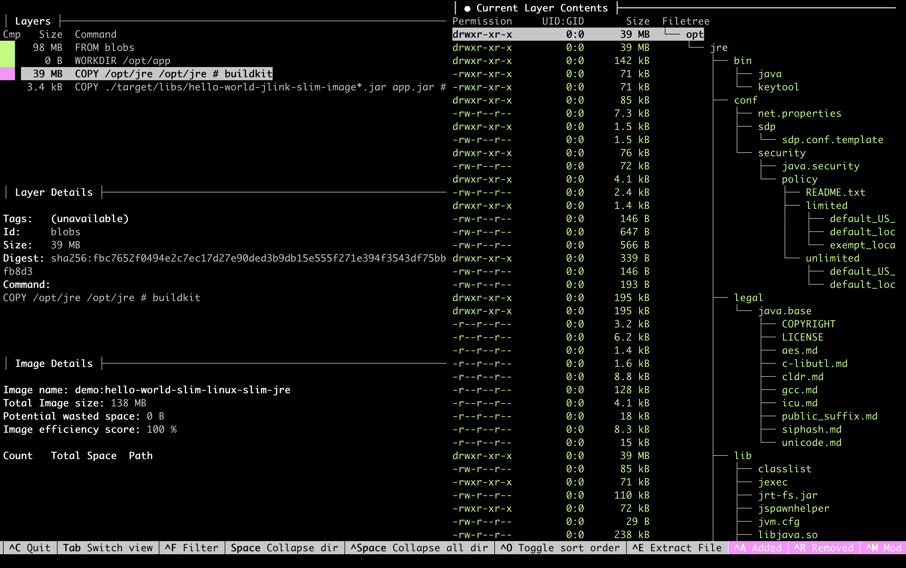
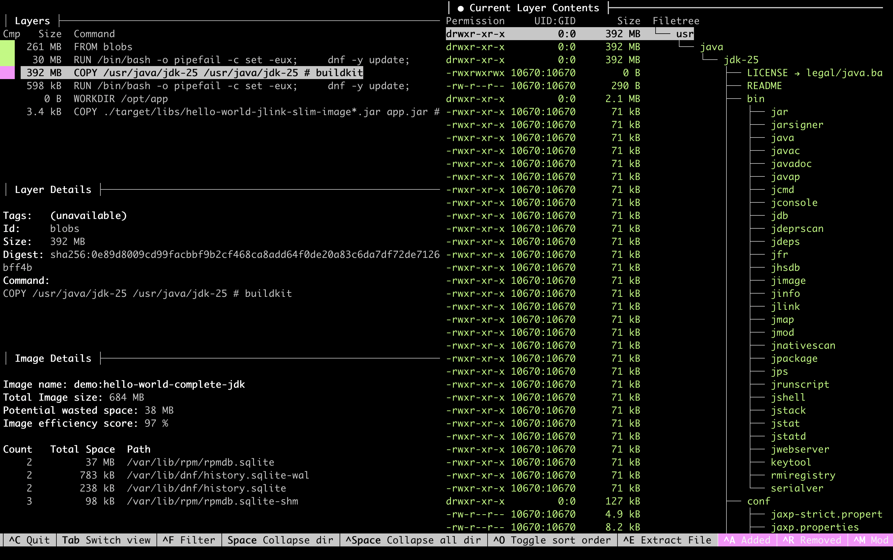

<!-- Generated by Sociable Weaver (https://github.com/albertattard/sw). Manual edits will be overwritten when regenerated. -->

# Hello World JLink Example

This example demonstrates how to build a container image that runs a Java
application with a custom runtime created by
[`jlink`](https://docs.oracle.com/en/java/javase/25/docs/specs/man/jlink.html).

The starting point is deliberately small: a modular Hello World application
that only needs `java.base`. That keeps the mechanics visible. The important
idea is the same for larger services: identify the Java modules the application
needs, create a runtime with only those modules, and copy that runtime into the
final container image instead of shipping a complete JDK.

Why do this in a container?

- A complete JDK contains development tools and modules that the running
  application does not use.
- A smaller runtime usually means a smaller final image, faster transfers, and
  less unused software in production.
- The custom runtime has to be regenerated when the Java version or module
  requirements change, so this is a build-time optimisation, not a reason to
  skip Java security updates.


This example is intentionally focused on one topic: building a smaller container
image with a custom Java runtime created by `jlink`.

It omits some production-oriented container concerns, such as running as a
non-root user, image signing, vulnerability scanning, runtime configuration,
observability, and deployment-specific hardening. Those topics are important,
but they are outside the scope of this example so the `jlink` mechanics remain
easy to follow.

For a more complete Spring Boot container example that combines several of these
concerns, see [all-in-one-spring-boot](../all-in-one-spring-boot/README.md).

## Prerequisites

- [Oracle Java 25](https://www.oracle.com/java/technologies/downloads/#java25)

- [Docker](https://docs.docker.com/get-docker/) runtime

- [Dive](https://github.com/wagoodman/dive), or other similar tool, to analyse
  the container image.

- [Oracle Account](https://profile.oracle.com/myprofile/account/create-account.jspx)
  to access [Oracle Container Registry](https://container-registry.oracle.com/)

- An Oracle Container Registry authentication token stored in
  `~/.ocr/auth-token`, or an equivalent secure way to pass the password to
  `docker login --password-stdin`.

### Accept the Terms and Conditions

Before you can use the Oracle Java images, you need to accept the terms and
conditions by navigating to
[https://container-registry.oracle.com/ords/ocr/ba/java/jdk](https://container-registry.oracle.com/ords/ocr/ba/java/jdk)
and logging in.

1. Accept the
   [Oracle Container Registry](https://container-registry.oracle.com/) terms and
   conditions.

   

   

2. Log in to `container-registry.oracle.com` using your Oracle account.

   The container tool needs access to Oracle Container Registry before it can
   pull the Oracle Java base image referenced by the Dockerfile. This example
   reads an Oracle authentication token from `~/.ocr/auth-token` and passes it
   to the login command through standard input so the token is not written into
   the shell history. If you are using Podman instead of Docker, use the same
   registry, username, and token with `podman login --password-stdin`.

   ```shell
   docker login container-registry.oracle.com \
     --username 'ALBERT.ATTARD@ORACLE.COM' \
     --password-stdin < ~/.ocr/auth-token
   ```

   This should print the login succeeded message.

   ```
   Login Succeeded!
   ```

   The container image used
   ([`container-registry.oracle.com/java/jdk:25.0.4.1`](https://container-registry.oracle.com/ords/ocr/ba/java/jdk))
   requires authentication.

## Build the application

The application is built once and then reused for the local runtime checks and
both container images. This matters because the comparison should isolate the
runtime packaging choice, not a different application build.

1. Build the application

   ```shell
   ./mvnw clean package
   ```

   (*Optional*) Verify that the application was created.

   ```shell
   tree './target/libs'
   ```

   The application JAR file.

   ```
   ./target/libs
   └── jlink-slim-image-hello-world-1.0.0.jar

   1 directory, 1 file
   ```

2. (*Optional*) Run the application

   ```shell
   java -jar './target/libs/jlink-slim-image-hello-world-1.0.0.jar'
   ```

   Prints the version of Java used to run it

   ```
   Building smaller image using JLink
   Using Java 25.0.4.1
   ```

## Custom JRE

This section continues on the previous section,
[Build the application](#build-the-application), as it takes the JAR file
created there as input to this section.

A custom runtime is built in two steps:

1. Use `jdeps` to identify the Java modules required by the application.
2. Use `jlink` to assemble a runtime image containing those modules.

The result is not a general-purpose JDK. It is a runtime directory with the
`java` launcher and the selected modules.

1. (*Optional*) Print the `jdeps` version (which will match that of the JDK).

   ```shell
   jdeps --version
   ```

   Prints the current JVM version

   ```
   25.0.4.1
   ```

2. Determine the modules required by our application.

   The
   [`jdeps`](https://docs.oracle.com/en/java/javase/25/docs/specs/man/jdeps.html)
   command can help us with that.

   ```shell
   jdeps \
     --multi-release 25 \
     --ignore-missing-deps \
     --print-module-deps \
     './target/libs/jlink-slim-image-hello-world-1.0.0.jar'
   ```

   Our application is very simple, and it only uses the base module.

   ```
   java.base
   ```

3. (*Optional*) Print the `jlink` version (which will match that of the JDK).

   ```shell
   jlink --version
   ```

   Prints the current JVM version

   ```
   25.0.4.1
   ```

4. Create a custom Java runtime (JRE) image using the modules listed in a prior
   step.

   The options remove development-time material that is not needed at runtime:

   - `--no-header-files` removes C header files.
   - `--no-man-pages` removes manual pages.
   - `--strip-debug` removes debug information.
   - `--compress=zip-9` compresses resources in the runtime image.

   ```shell
   rm -rf './target/slim-jre'
   jlink \
     --output './target/slim-jre' \
     --no-header-files \
     --no-man-pages \
     --add-modules java.base \
     --strip-debug \
     --compress=zip-9
   ```

   (*Optional*) Measure the size of the custom Java runtime (JRE) image and
   compare this with the size of the full JDK.

   ```shell
   du -sh './target/slim-jre'
   ```

   This custom Java runtime (JRE) takes only `40M`.

   ```
   40M	./target/slim-jre
   ```

   ```shell
   du -sh "${JAVA_25_HOME}"
   ```

   This full JDK requires `376M`.

   ```
   376M	/usr/lib/jvm/jdk-25
   ```

   This image contains only the Java modules that are required by this
   application. Different applications may require different modules, so do not
   copy `--add-modules java.base` blindly into another service. Re-run `jdeps`
   for the application you are packaging.

   (*Optional*) List the extracted modules.

   ```shell
   './target/slim-jre/bin/java' --list-modules
   ```

   Our custom image only contains one Java module.

   ```
   java.base@25.0.4.1
   ```

   (*Optional*) List the custom Java runtime (JRE) image directory structure.

   ```shell
   tree --dirsfirst --sort=name -L 1 './target/slim-jre'
   ```

   The results are limited to the top level for brevity.

   ```
   ./target/slim-jre
   ├── bin
   ├── conf
   ├── legal
   ├── lib
   └── release

   5 directories, 1 file
   ```

5. (*Optional*) Run the application using the custom Java runtime (JRE) image

   ```shell
   './target/slim-jre/bin/java' -jar './target/libs/jlink-slim-image-hello-world-1.0.0.jar'
   ```

## Container Image

This section continues on the previous section,
[Build the application](#build-the-application), as it takes the JAR file
created there as input to this section.

The local `jlink` command above showed the mechanics. In a container build, the
same work happens inside a builder stage so the local machine does not have to
contribute files from its own JDK installation.

The slim Dockerfile uses two stages:

- The builder stage starts from the Oracle JDK image, installs `binutils`
  because `jlink --strip-debug` needs it, and creates `/opt/jre` from the
  modules passed through `JAVA_MODULES`.
- The final stage starts from Oracle Linux slim, copies only `/opt/jre` and the
  application JAR, and runs the application with `/opt/jre/bin/java`.

1. Build the Slim container image.

   This example uses a multi-stage Docker build, where the custom Java runtime
   (JRE) image is created and used to run the application.

   ```dockerfile
   FROM container-registry.oracle.com/java/jdk:25.0.4.1 AS builder
   WORKDIR /opt

   ARG JAVA_MODULES=java.base

   # binutils are needed by the `--strip-debug` command line option
   RUN dnf install -y binutils && dnf clean all
   RUN jlink \
         --output './jre' \
         --no-header-files \
         --no-man-pages \
         --strip-debug \
         --add-modules "${JAVA_MODULES}" \
         --compress=zip-9

   FROM container-registry.oracle.com/os/oraclelinux:10-slim
   WORKDIR /opt/app

   # Copy the custom Java image
   COPY --from=builder /opt/jre /opt/jre

   ARG JAR_FILE=./target/libs/jlink-slim-image-hello-world-1.0.0.jar

   COPY ${JAR_FILE} app.jar

   ENTRYPOINT ["/opt/jre/bin/java", "-jar", "app.jar"]
   ```

   Java receives security updates at least once every three months, as described
   in the
   [Critical Patch Updates](https://www.oracle.com/security-alerts/#CriticalPatchUpdates).
   Rebuild this image when the JDK base image changes. A custom runtime reduces
   what is copied into the final image, but it does not remove the need to keep
   that runtime patched.

   The Dockerfile defaults `JAVA_MODULES` to `java.base` because this Hello
   World application only depends on that module. For another application, use
   the module list reported by `jdeps --print-module-deps` instead of reusing
   this default blindly.

   Build the container image and load it into the local docker daemon.

   ```shell
   docker build \
     --file './containers/Dockerfile-Slim-Linux-Slim-JRE' \
     --tag 'demo:hello-world-slim-linux-slim-jre' \
     --load \
     .
   ```

   This will take a few seconds to build.

2. Analyse the Slim JRE container image

   ```shell
   docker images 'demo:hello-world-slim-linux-slim-jre' \
     --format "{{.Repository}}:{{.Tag}} -> {{.Size}}"
   ```

   This prints the total size of the container image which includes the
   application.

   ```
   localhost/demo:hello-world-slim-linux-slim-jre -> 143 MB
   ```

   List the layers that were added by our Dockerfile.

   ```shell
   docker history 'demo:hello-world-slim-linux-slim-jre'
   ```

   The history of the `hello-world-slim-linux-slim-jre` image.

   ```
   ID            CREATED                 CREATED BY                                     SIZE        COMMENT
   2bf0e68de611  Less than a second ago  /bin/sh -c #(nop) ENTRYPOINT ["/opt/jre/bi...  0B
   <missing>     Less than a second ago  /bin/sh -c #(nop) COPY file:d3db93a5efdbf3...  6.66kB
   562102530d7c  Less than a second ago  /bin/sh -c #(nop) ARG JAR_FILE                 0B
   <missing>     Less than a second ago  /bin/sh -c #(nop) COPY dir:39b59799621a679...  41.4MB
   ed9a0fbdd012  2 hours ago             /bin/sh -c #(nop) WORKDIR /opt/app             0B          FROM container-registry.oracle.com/os/oraclelinux:10-slim
   <missing>     3 weeks ago             /bin/sh -c #(nop) CMD ["/bin/bash"]            0B
   <missing>     3 weeks ago             /bin/sh -c #(nop) ADD file:6d484c76cf6fbf1...  101MB
   ```

   Analyse the container image using Dive.

   ```shell
   dive 'demo:hello-world-slim-linux-slim-jre'
   ```

   

   The JRE on this container takes about `41.4MB`.

3. (*Optional*) Run the Slim JRE container image

   ```shell
   docker run \
     --rm \
     --name 'hello-world-slim-linux-slim-jre' \
     'demo:hello-world-slim-linux-slim-jre'
   ```

   Prints the version of Java that is packaged in the container

   ```
   Building smaller image using JLink
   Using Java 25.0.4.1
   ```

4. Build the Complete JDK container image.

   This comparison image keeps the complete JDK in the final image. It is a
   useful baseline because it runs the same JAR with a much simpler Dockerfile.

   The minimal version is enough to run this example, but it leaves a few
   production-readiness details implicit:

   ```dockerfile
   FROM container-registry.oracle.com/java/jdk:25.0.4.1
   WORKDIR /opt/app

   ARG JAR_FILE=./target/libs/jlink-slim-image-hello-world-1.0.0.jar

   COPY ${JAR_FILE} app.jar

   ENTRYPOINT ["java", "-jar", "app.jar"]
   ```

   The version used for the build below keeps the complete JDK baseline while
   making the artefact path deterministic.

   Build the container image and load it into the local docker daemon.

   ```shell
   docker build \
     --file './containers/Dockerfile-Complete-JDK' \
     --tag 'demo:hello-world-complete-jdk' \
     --load \
     .
   ```

   This will take a few seconds to build.

5. Analyse the Complete JDK container image

   ```shell
   docker images 'demo:hello-world-complete-jdk' \
     --format "{{.Repository}}:{{.Tag}} -> {{.Size}}"
   ```

   This prints the total size of the container image which includes the
   application.

   ```
   localhost/demo:hello-world-complete-jdk -> 747 MB
   ```

   List the layers that were added by our Dockerfile.

   ```shell
   docker history 'demo:hello-world-complete-jdk'
   ```

   This image keeps the complete JDK layer in the final runtime image.

   ```
   ID            CREATED                 CREATED BY                                     SIZE        COMMENT
   c9097e53f99f  Less than a second ago  /bin/sh -c #(nop) ENTRYPOINT ["java", "-ja...  0B
   <missing>     Less than a second ago  /bin/sh -c #(nop) COPY file:d3db93a5efdbf3...  6.66kB
   2c630dad489c  2 hours ago             /bin/sh -c #(nop) ARG JAR_FILE                 0B
   <missing>     2 hours ago             /bin/sh -c #(nop) WORKDIR /opt/app             0B          FROM container-registry.oracle.com/java/jdk:25.0.4.1
   <missing>     3 weeks ago             CMD ["jshell"]                                 0B          buildkit.dockerfile.v0
   <missing>     3 weeks ago             RUN /bin/bash -o pipefail -c set -eux;    ...  294kB       buildkit.dockerfile.v0
   <missing>     3 weeks ago             COPY /usr/java/jdk-25 /usr/java/jdk-25 # b...  394MB       buildkit.dockerfile.v0
   <missing>     3 weeks ago             ENV PATH=/usr/java/jdk-25/bin:/usr/local/s...  0B          buildkit.dockerfile.v0
   <missing>     3 weeks ago             ENV JAVA_HOME=/usr/java/jdk-25                 0B          buildkit.dockerfile.v0
   <missing>     3 weeks ago             ENV LANG=en_US.UTF-8                           0B          buildkit.dockerfile.v0
   <missing>     3 weeks ago             RUN /bin/bash -o pipefail -c set -eux;         dn...       106MB       buildkit.dockerfile.v0
   <missing>     3 weeks ago             SHELL [/bin/bash -o pipefail -c]               0B          buildkit.dockerfile.v0
   <missing>     6 weeks ago             /bin/sh -c #(nop) CMD ["/bin/bash"]            0B          FROM 408c2f02d337
   <missing>     6 weeks ago             /bin/sh -c #(nop) ADD file:0ba597b37b1062b...  247MB
   ```

   Analyse the container image using Dive.

   ```shell
   dive 'demo:hello-world-complete-jdk'
   ```

   

   The JRE on this container takes about `394MB`.

6. (*Optional*) Run the complete JDK container image

   ```shell
   docker run \
     --rm \
     --name 'hello-world-complete-jdk' \
     'demo:hello-world-complete-jdk'
   ```

   Prints the version of Java that is packaged in the container

   ```
   Building smaller image using JLink
   Using Java 25.0.4.1
   ```
