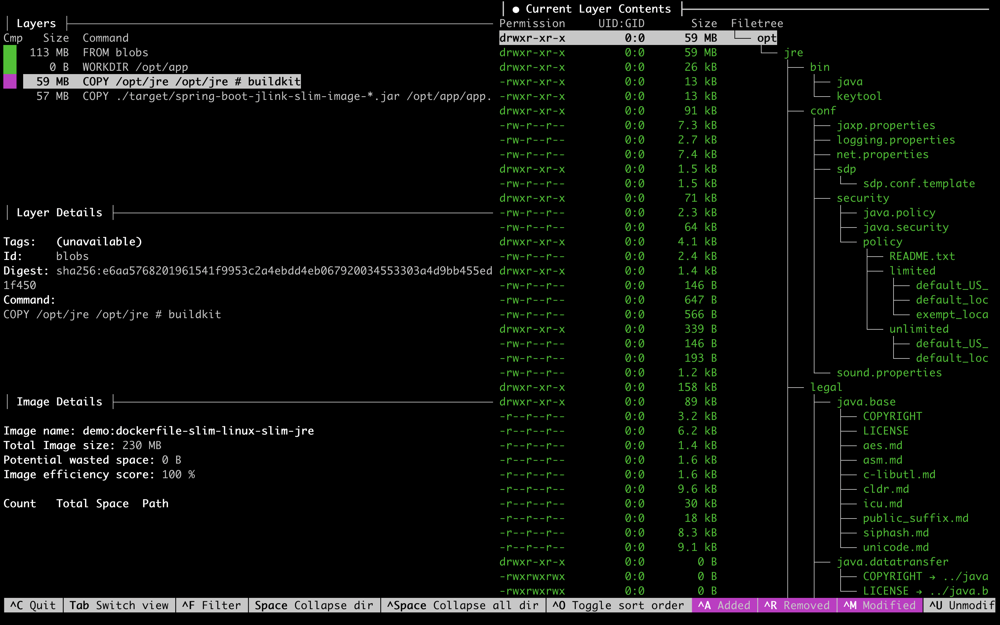

<!-- Generated by Sociable Weaver (https://github.com/albertattard/sw). Manual edits will be overwritten when regenerated. -->

# Spring Boot Web Application using Slim Java runtime (JRE)

A simple Spring Boot web application used to demonstrate how to package a
real framework-based service with a slim Java runtime (JRE) in a container
image.

The complete JDK contains many tools that while needed during development and
debugging, these are not required during runtime. Furthermore, having the
complete JDK adds to the container image size and, worse, increases the attack
surface area without adding any value. In this example we will see how to create
a custom Java image that contains just enough to run our application, reducing
both the container image size and the attack surface area.

This example builds on the simpler Hello World JLink runbook. The goal here is
the same, but the application is more realistic: it uses Spring Boot, Spring
MVC, Spring Data JPA, Flyway, H2, and Guava. That makes the module analysis less
direct because the executable Spring Boot JAR contains nested dependency JARs.

This example is intentionally focused on one topic: building a smaller Spring
Boot container image with a custom Java runtime created by `jlink`. It omits
some production-oriented container concerns, such as running as a non-root
user, image signing, vulnerability scanning, observability, and
deployment-specific hardening, so the `jlink` mechanics remain easy to follow.
For a more complete Spring Boot container example that combines several
concerns, see [all-in-one-spring-boot](../all-in-one-spring-boot/README.md).

By the end, you will have:

- built and run the Spring Boot application with the full JDK;
- identified the Java modules needed by the application;
- created and tested a custom runtime with `jlink`;
- built a slim container image that copies only that runtime and the application
  JAR;
- compared it with a baseline image that keeps the complete JDK.

This simple application has one endpoint that returns a random quote from its
database.

**Resources**

- [Java into Containers, A Match Made in Heaven?](https://inside.java/2022/04/06/java-in-containers/)
- [Jlink - Assemble and Optimize a Set of Modules](https://dev.java/learn/jvm/tools/core/jlink)
- [Java’s Custom Runtime Builder - jlink](https://www.youtube.com/watch?v=3UCBmdbeYm4)

## Prerequisites

- [Oracle Java 25](https://www.oracle.com/java/technologies/downloads/#java25)

- [Docker](https://docs.docker.com/get-docker/) runtime

- `curl`, used to call the Spring Boot endpoint.

- `jq`, used to format the JSON response returned by the application.

- `tree`, used to inspect generated directories in the walkthrough.

- [Dive](https://github.com/wagoodman/dive), or other similar tool, to analyse
  the container image.

- [Oracle Account](https://profile.oracle.com/myprofile/account/create-account.jspx)
  to access [Oracle Container Registry](https://container-registry.oracle.com/)

- An Oracle Container Registry authentication token stored in
  `~/.ocr/auth-token`, or an equivalent secure way to pass the password to
  `docker login --password-stdin`.

### Accept the Terms and Conditions

Before you can use the Oracle Java images, you need to accept the terms and
conditions by navigating to
[https://container-registry.oracle.com/ords/ocr/ba/java/jdk](https://container-registry.oracle.com/ords/ocr/ba/java/jdk)
and logging in.

1. Accept the
   [Oracle Container Registry](https://container-registry.oracle.com/) terms and
   conditions.

   

   

2. Log in to `container-registry.oracle.com` using your Oracle account.

   The container tool needs access to Oracle Container Registry before it can
   pull the Oracle Java base image referenced by the Dockerfile. This example
   reads an Oracle authentication token from `~/.ocr/auth-token` and passes it
   to the login command through standard input so the token is not written into
   the shell history. If you are using Podman instead of Docker, use the same
   registry, username, and token with `podman login --password-stdin`.

   ```shell
   docker login container-registry.oracle.com \
     --username 'ALBERT.ATTARD@ORACLE.COM' \
     --password-stdin < ~/.ocr/auth-token
   ```

   This should print the login succeeded message.

   ```
   Login Succeeded!
   ```

   The container image used
   ([`container-registry.oracle.com/java/jdk:25.0.4.1`](https://container-registry.oracle.com/ords/ocr/ba/java/jdk))
   requires authentication.

## Build the application

The application is built once and then reused for the local runtime checks and
both container images. This matters because the comparison should isolate the
runtime packaging choice, not a different application build.

1. Build the application

   ```shell
   ./mvnw clean package
   ```

   (*Optional*) Verify that the application was created.

   ```shell
   tree --dirsfirst --sort=name -L 1 --prune './target/'
   ```

   Spring Boot creates one executable JAR containing the application classes,
   Spring Boot launcher, and nested dependency JARs.

   ```
   ./target/
   ├── jlink-slim-image-spring-boot-1.0.0.jar
   └── jlink-slim-image-spring-boot-1.0.0.jar.original

   1 directory, 2 files
   ```

2. (*Optional*) Run the application

   The application is started in the background for convenience, otherwise the
   subsequent commands need to be executed in another terminal.

   ```shell
   java -jar './target/jlink-slim-image-spring-boot-1.0.0.jar' > './target/output.txt' 2>&1 &
   echo $! > './target/application.pid'
   ```

   Wait for the application to start.

   ```shell
   while [ "$(curl --silent --output /dev/null --write-out '%{http_code}' 'http://localhost:8080/quote/random')" -ne '200' ]
   do
     echo 'Waiting for the application to start'
     sleep 1
   done
   ```

   Fetch a random quote.

   ```shell
   curl --silent 'http://localhost:8080/quote/random' | jq
   ```

   The response should be similar to the following.

   ```json
   {
     "id": 21,
     "author": "Aristotle",
     "quote": "It is the mark of an educated mind to be able to entertain a thought without accepting it."
   }
   ```

   Stop the application.

   ```shell
   kill "$(cat './target/application.pid')"
   ```

## Custom JRE

This section continues on the previous section,
[Build the application](#build-the-application), as it takes the JAR file
created there as input to this section.

A JLink image is not a container image. It is a custom Java runtime directory
that can later be copied into a container image. The important part here is the
module list: leave out a required module and the application may start failing
at runtime.

1. (*Optional*) Print the `jdeps` version (which will match that of the JDK).

   ```shell
   jdeps --version
   ```

   Prints the current JVM version

   ```
   25.0.4.1
   ```

2. Determine the modules required by our application.

   The
   [`jdeps`](https://docs.oracle.com/en/java/javase/25/docs/specs/man/jdeps.html)
   command can help us with that.

   ```shell
   jdeps \
     --multi-release 25 \
     --ignore-missing-deps \
     --print-module-deps \
     './target/jlink-slim-image-spring-boot-1.0.0.jar'
   ```

   Unfortunately, this will only print `java.base,java.management`, which is
   incorrect.

   ```
   java.base,java.management
   ```

   This result is misleading because the artefact is a repackaged Spring Boot
   executable JAR. The application classes are placed under `BOOT-INF/classes`,
   dependencies are stored as nested JARs under `BOOT-INF/lib`, and the Spring
   Boot launcher builds the runtime classpath when the JAR starts. That layout
   is convenient for `java -jar`, but it is not the normal flat classpath layout
   that static analysis tools such as `jdeps` expect when they inspect the outer
   JAR.

   (*Optional*) Inspect the executable Spring Boot JAR layout.

   ```shell
   jar --list \
     --file './target/jlink-slim-image-spring-boot-1.0.0.jar' |
     grep -E '^(BOOT-INF/classes|BOOT-INF/lib)' |
     head -40
   ```

   The listing shows the application classes and nested dependency JARs inside
   the Spring Boot executable JAR.

   ```
   BOOT-INF/classes/
   BOOT-INF/classes/db/
   BOOT-INF/classes/db/migration/
   BOOT-INF/classes/demo/
   BOOT-INF/classes/demo/quote/
   BOOT-INF/classes/application.yml
   BOOT-INF/classes/db/migration/V1__create_database.sql
   BOOT-INF/classes/banner.txt
   BOOT-INF/classes/demo/Main.class
   BOOT-INF/classes/demo/quote/Quote.class
   BOOT-INF/classes/demo/quote/QuoteController.class
   BOOT-INF/classes/demo/quote/QuoteService.class
   BOOT-INF/classes/demo/quote/QuoteRepository.class
   BOOT-INF/lib/
   BOOT-INF/lib/spring-boot-jackson-4.1.1.jar
   BOOT-INF/lib/jackson-databind-3.1.5.jar
   BOOT-INF/lib/jackson-annotations-2.21.jar
   BOOT-INF/lib/jackson-core-3.1.5.jar
   BOOT-INF/lib/tomcat-embed-core-11.0.24.jar
   BOOT-INF/lib/tomcat-embed-el-11.0.24.jar
   BOOT-INF/lib/tomcat-embed-websocket-11.0.24.jar
   BOOT-INF/lib/spring-boot-tomcat-4.1.1.jar
   BOOT-INF/lib/spring-boot-http-converter-4.1.1.jar
   BOOT-INF/lib/spring-boot-4.1.1.jar
   BOOT-INF/lib/spring-context-7.0.9.jar
   BOOT-INF/lib/spring-web-7.0.9.jar
   BOOT-INF/lib/spring-beans-7.0.9.jar
   BOOT-INF/lib/micrometer-observation-1.17.1.jar
   BOOT-INF/lib/micrometer-commons-1.17.1.jar
   BOOT-INF/lib/spring-boot-webmvc-4.1.1.jar
   BOOT-INF/lib/spring-boot-servlet-4.1.1.jar
   BOOT-INF/lib/spring-webmvc-7.0.9.jar
   BOOT-INF/lib/spring-aop-7.0.9.jar
   BOOT-INF/lib/spring-expression-7.0.9.jar
   BOOT-INF/lib/h2-2.4.240.jar
   BOOT-INF/lib/logback-classic-1.5.38.jar
   BOOT-INF/lib/logback-core-1.5.38.jar
   BOOT-INF/lib/log4j-to-slf4j-2.25.5.jar
   BOOT-INF/lib/log4j-api-2.25.5.jar
   BOOT-INF/lib/jul-to-slf4j-2.0.18.jar
   ```

   To give `jdeps` a dependency view closer to the application’s runtime
   classpath, provide the dependencies explicitly with the `--class-path`
   option. We can obtain the list of dependencies using Maven’s
   `dependency:build-classpath` goal, and save the list of dependencies to file,
   as shown next.

   ```shell
   ./mvnw \
     dependency:build-classpath \
     -Dmdep.outputFile='./target/classpath.txt'
   ```

   (*Optional*) Verify that the class path is saved to file.

   ```shell
   tree --dirsfirst --sort=name -L 1 --prune -P 'classpath.txt' './target'
   ```

   The file containing the runtime classpath

   ```
   ./target
   └── classpath.txt

   1 directory, 1 file
   ```

   Use this file to provide the class path to `jdeps`.

   ```shell
   jdeps \
     --class-path "$(cat './target/classpath.txt')" \
     --multi-release 25 \
     --ignore-missing-deps \
     --print-module-deps \
     './target/jlink-slim-image-spring-boot-1.0.0.jar'
   ```

   This time we will get a lot of more dependencies.

   ```
   java.base,java.compiler,java.desktop,java.instrument,java.management,java.naming,java.net.http,java.prefs,java.rmi,java.scripting,java.security.jgss,java.sql,jdk.jfr,jdk.unsupported
   ```

   `jdeps` reports the modules it can see from the application classes and the
   dependency class path. Treat that output as the starting point, then verify
   the reduced module list by running the application with the custom runtime.
   For this application, the runtime can be trimmed to:

   ```
   java.base,java.compiler,java.desktop,java.instrument,java.management,java.naming,java.sql,java.security.jgss
   ```

   The `java.compiler` module is required because Spring Data’s AOT repository
   processor uses `javax.lang.model.SourceVersion` at runtime. This is a useful
   reminder that framework applications can have runtime dependencies that are
   not obvious from your own code.

   If you are using an older update of Java 21, please note that there is a
   [bug](https://bugs.openjdk.org/browse/JDK-8330005), which does not load the
   random number service provider and fails with the following example. In that
   case, add the `jdk.random` module as a workaround. This runbook uses Java 25,
   where that workaround should not be needed.

   ```
   java.lang.IllegalArgumentException: No implementation of the random number generator algorithm "L32X64MixRandom" is available
     at java.base/java.util.random.RandomGeneratorFactory.findProvider(Unknown Source) ~[na:na]
     at java.base/java.util.random.RandomGeneratorFactory.of(Unknown Source) ~[na:na]
     at java.base/java.util.random.RandomGenerator.of(Unknown Source) ~[na:na]
     at java.base/java.util.random.RandomGenerator.getDefault(Unknown Source) ~[na:na]
   ...
   ```

3. (*Optional*) Print the `jlink` version (which will match that of the JDK).

   ```shell
   jlink --version
   ```

   Prints the current JVM version

   ```
   25.0.4.1
   ```

4. Create a custom Java runtime (JRE) image using the modules listed in a prior
   step.

   ```shell
   rm -rf './target/slim-jre'
   jlink \
     --output './target/slim-jre' \
     --no-header-files \
     --no-man-pages \
     --add-modules java.base,java.compiler,java.desktop,java.instrument,java.management,java.naming,java.sql,java.security.jgss \
     --strip-debug \
     --compress=zip-9
   ```

   (*Optional*) Measure the size of the custom Java runtime (JRE) image

   ```shell
   du -sh './target/slim-jre'
   ```

   This custom Java runtime (JRE) takes only about `59M`.

   ```
   59M	./target/slim-jre
   ```

   This image contains only the Java modules that are required by this
   application. Different applications may require different modules.

   (*Optional*) List the extracted modules.

   ```shell
   './target/slim-jre/bin/java' --list-modules
   ```

   These are the modules included in our custom image.

   ```
   java.base@25.0.4.1
   java.compiler@25.0.4.1
   java.datatransfer@25.0.4.1
   java.desktop@25.0.4.1
   java.instrument@25.0.4.1
   java.logging@25.0.4.1
   java.management@25.0.4.1
   java.naming@25.0.4.1
   java.prefs@25.0.4.1
   java.security.jgss@25.0.4.1
   java.security.sasl@25.0.4.1
   java.sql@25.0.4.1
   java.transaction.xa@25.0.4.1
   java.xml@25.0.4.1
   ```

   (*Optional*) List the custom Java runtime (JRE) image directory structure.

   ```shell
   tree --dirsfirst --sort=name -L 1 './target/slim-jre'
   ```

   The results are limited to the top level for brevity.

   ```
   ./target/slim-jre
   ├── bin
   ├── conf
   ├── legal
   ├── lib
   └── release

   5 directories, 1 file
   ```

5. Run the application using the custom Java runtime (JRE) image

   The application is started in the background for convenience, otherwise the
   subsequent commands need to be executed in another terminal.

   ```shell
   './target/slim-jre/bin/java' \
     -jar './target/jlink-slim-image-spring-boot-1.0.0.jar' > './target/output.txt' 2>&1 &
   echo $! > './target/application.pid'
   ```

   Wait for the application to start.

   ```shell
   while [ "$(curl --silent --output /dev/null --write-out '%{http_code}' 'http://localhost:8080/quote/random')" -ne '200' ]
   do
     echo 'Waiting for the application to start'
     sleep 1
   done
   ```

   Fetch a random quote.

   ```shell
   curl --silent 'http://localhost:8080/quote/random' | jq
   ```

   The response should be similar to the following.

   ```json
   {
     "id": 186,
     "author": "Winston Churchill",
     "quote": "Courage is what it takes to stand up and speak; courage is also what it takes to sit down and listen."
   }
   ```

   Stop the application.

   ```shell
   kill "$(cat './target/application.pid')"
   ```

## Container Image

This section continues from the previous sections. The application JAR was
produced in [Build the application](#build-the-application), and the custom
runtime module list was proven in [Custom JRE](#custom-jre).

The local `jlink` command showed the mechanics. In the container build, the same
work happens inside a builder stage so the final image does not depend on files
from the local JDK installation.

The slim Dockerfile uses two stages:

- The builder stage starts from the Oracle JDK image, installs `binutils`
  because `jlink --strip-debug` needs it, and creates `/opt/jre` from the Spring
  Boot module list passed through `JAVA_MODULES`.
- The final stage starts from Oracle Linux slim, copies only `/opt/jre` and the
  executable Spring Boot JAR, and runs the application with `/opt/jre/bin/java`.

1. Build the Slim container image.

   This example makes use of multi-stage docker build, where the custom Java
   runtime (JRE) image is created and used to run the application.

   ```dockerfile
   FROM container-registry.oracle.com/java/jdk:25.0.4.1 AS builder
   WORKDIR /opt

   ARG JAVA_MODULES=java.base,java.compiler,java.desktop,java.instrument,java.management,java.naming,java.sql,java.security.jgss

   # binutils are needed by the `--strip-debug` command line option
   RUN dnf install -y binutils && dnf clean all
   RUN jlink \
         --output './jre' \
         --no-header-files \
         --no-man-pages \
         --strip-debug \
         --add-modules "${JAVA_MODULES}" \
         --compress=zip-9

   FROM container-registry.oracle.com/os/oraclelinux:10-slim
   WORKDIR /opt/app

   # Copy the custom Java image
   COPY --from=builder /opt/jre /opt/jre

   ARG JAR_FILE=./target/jlink-slim-image-spring-boot-1.0.0.jar

   COPY ${JAR_FILE} app.jar

   ENTRYPOINT ["/opt/jre/bin/java", "-jar", "app.jar"]
   ```

   Java receives security updates at least once every three months, as described
   in the
   [Critical Patch Updates](https://www.oracle.com/security-alerts/#CriticalPatchUpdates).
   Rebuild this image when the JDK base image changes. A custom runtime reduces
   what is copied into the final image, but it does not remove the need to keep
   that runtime patched.

   The Dockerfile defaults `JAVA_MODULES` to the module list verified earlier in
   this runbook:

   ```
   java.base,java.compiler,java.desktop,java.instrument,java.management,java.naming,java.sql,java.security.jgss
   ```

   For another Spring Boot service, re-run `jdeps`, inspect the result, and test
   the custom runtime before copying this list. Dependencies, starters, database
   drivers, and framework features can change the modules required at runtime.

   Build the container image and load it into the local docker daemon.

   ```shell
   docker build \
     --file './containers/Dockerfile-Slim-Linux-Slim-JRE' \
     --tag 'demo:dockerfile-slim-linux-slim-jre' \
     --load \
     .
   ```

   This will take a few seconds to build.

2. Analyse the Slim JRE container image

   ```shell
   docker images 'demo:dockerfile-slim-linux-slim-jre' \
     --format "{{.Repository}}:{{.Tag}} -> {{.Size}}"
   ```

   This prints the total size of the container image which includes the
   application.

   ```
   localhost/demo:dockerfile-slim-linux-slim-jre -> 219 MB
   ```

   List the layers that were added by our Dockerfile.

   ```shell
   docker history 'demo:dockerfile-slim-linux-slim-jre'
   ```

   The history of the `dockerfile-slim-linux-slim-jre` image

   ```
   ID            CREATED                 CREATED BY                                     SIZE        COMMENT
   8fb239ee3dd9  Less than a second ago  /bin/sh -c #(nop) ENTRYPOINT ["/opt/jre/bi...  0B
   <missing>     Less than a second ago  /bin/sh -c #(nop) COPY file:1d47f115cddf21...  56.5MB
   246b4cc3ad57  1 second ago            /bin/sh -c #(nop) ARG JAR_FILE                 0B
   <missing>     2 hours ago             /bin/sh -c #(nop) COPY dir:bae17faa4bcc295...  61.4MB
   ed9a0fbdd012  2 hours ago             /bin/sh -c #(nop) WORKDIR /opt/app             0B          FROM container-registry.oracle.com/os/oraclelinux:10-slim
   <missing>     3 weeks ago             /bin/sh -c #(nop) CMD ["/bin/bash"]            0B
   <missing>     3 weeks ago             /bin/sh -c #(nop) ADD file:6d484c76cf6fbf1...  101MB
   ```

   Analyse the container image using Dive.

   ```shell
   dive 'demo:dockerfile-slim-linux-slim-jre'
   ```

   

   The JRE on this container takes about `61.4MB`.

   

3. (*Optional*) Run the Slim JRE container image

   ```shell
   docker run \
     --rm \
     --detach \
     --name 'slim-jre' \
     --publish 8080:8080 \
     'demo:dockerfile-slim-linux-slim-jre'
   ```

   Wait for the container to start.

   ```shell
   while [ "$(curl --silent --output /dev/null --write-out '%{http_code}' 'http://localhost:8080/quote/random')" -ne '200' ]
   do
     echo 'Waiting for the container to start'
     sleep 1
   done
   ```

   Fetch a random quote.

   ```shell
   curl --silent 'http://localhost:8080/quote/random' | jq
   ```

   The response should be similar to the following.

   ```json
   {
     "id": 57,
     "author": "Eleanor Roosevelt",
     "quote": "People grow through experience if they meet life honestly and courageously. This is how character is built."
   }
   ```

   Stop the container once ready.

   ```shell
   docker stop 'slim-jre'
   ```

4. Build the Complete JDK container image.

   This comparison image keeps the complete JDK in the final image. It runs the
   same executable Spring Boot JAR with a simpler Dockerfile, which makes it a
   useful baseline for the slim-runtime version.

   ```dockerfile
   FROM container-registry.oracle.com/java/jdk:25.0.4.1
   WORKDIR /opt/app

   ARG JAR_FILE=./target/jlink-slim-image-spring-boot-1.0.0.jar

   COPY ${JAR_FILE} app.jar

   ENTRYPOINT ["java", "-jar", "app.jar"]
   ```

   The version used for the build below keeps the complete JDK baseline while
   making the artefact path deterministic.

   Build the container image and load it into the local docker daemon.

   ```shell
   docker build \
     --file './containers/Dockerfile-Complete-JDK' \
     --tag 'demo:complete-jdk' \
     --load \
     .
   ```

   This will take a few seconds to build.

5. Analyse the Complete JDK container image

   ```shell
   docker images 'demo:complete-jdk' \
     --format "{{.Repository}}:{{.Tag}} -> {{.Size}}"
   ```

   This prints the total size of the container image which includes the
   application.

   ```
   localhost/demo:complete-jdk -> 804 MB
   ```

   List the layers that were added by our Dockerfile.

   ```shell
   docker history 'demo:complete-jdk'
   ```

   This image keeps the complete JDK layer in the final runtime image.

   ```
   ID            CREATED                 CREATED BY                                     SIZE        COMMENT
   e6ea480d8ebc  Less than a second ago  /bin/sh -c #(nop) ENTRYPOINT ["java", "-ja...  0B
   <missing>     Less than a second ago  /bin/sh -c #(nop) COPY file:1d47f115cddf21...  56.5MB
   2c630dad489c  2 hours ago             /bin/sh -c #(nop) ARG JAR_FILE                 0B
   <missing>     2 hours ago             /bin/sh -c #(nop) WORKDIR /opt/app             0B          FROM container-registry.oracle.com/java/jdk:25.0.4.1
   <missing>     3 weeks ago             CMD ["jshell"]                                 0B          buildkit.dockerfile.v0
   <missing>     3 weeks ago             RUN /bin/bash -o pipefail -c set -eux;    ...  294kB       buildkit.dockerfile.v0
   <missing>     3 weeks ago             COPY /usr/java/jdk-25 /usr/java/jdk-25 # b...  394MB       buildkit.dockerfile.v0
   <missing>     3 weeks ago             ENV PATH=/usr/java/jdk-25/bin:/usr/local/s...  0B          buildkit.dockerfile.v0
   <missing>     3 weeks ago             ENV JAVA_HOME=/usr/java/jdk-25                 0B          buildkit.dockerfile.v0
   <missing>     3 weeks ago             ENV LANG=en_US.UTF-8                           0B          buildkit.dockerfile.v0
   <missing>     3 weeks ago             RUN /bin/bash -o pipefail -c set -eux;         dn...       106MB       buildkit.dockerfile.v0
   <missing>     3 weeks ago             SHELL [/bin/bash -o pipefail -c]               0B          buildkit.dockerfile.v0
   <missing>     6 weeks ago             /bin/sh -c #(nop) CMD ["/bin/bash"]            0B          FROM 408c2f02d337
   <missing>     6 weeks ago             /bin/sh -c #(nop) ADD file:0ba597b37b1062b...  247MB
   ```

   Analyse the container image using Dive.

   ```shell
   dive 'demo:complete-jdk'
   ```

   

   The complete JDK layer in this container takes about `394MB`.

   

6. (*Optional*) Run the complete JDK container image

   ```shell
   docker run \
     --rm \
     --detach \
     --name 'complete-jdk' \
     --publish 8080:8080 \
     'demo:complete-jdk'
   ```

   Wait for the container to start.

   ```shell
   while [ "$(curl --silent --output /dev/null --write-out '%{http_code}' 'http://localhost:8080/quote/random')" -ne '200' ]
   do
     echo 'Waiting for the container to start'
     sleep 1
   done
   ```

   Fetch a random quote.

   ```shell
   curl --silent 'http://localhost:8080/quote/random' | jq
   ```

   The response should be similar to the following.

   ```json
   {
     "author": "Albert Einstein",
     "id": 12,
     "quote": "Life is like riding a bicycle. To keep your balance, you must keep moving."
   }
   ```

   Stop the container once ready.

   ```shell
   docker stop 'complete-jdk'
   ```
